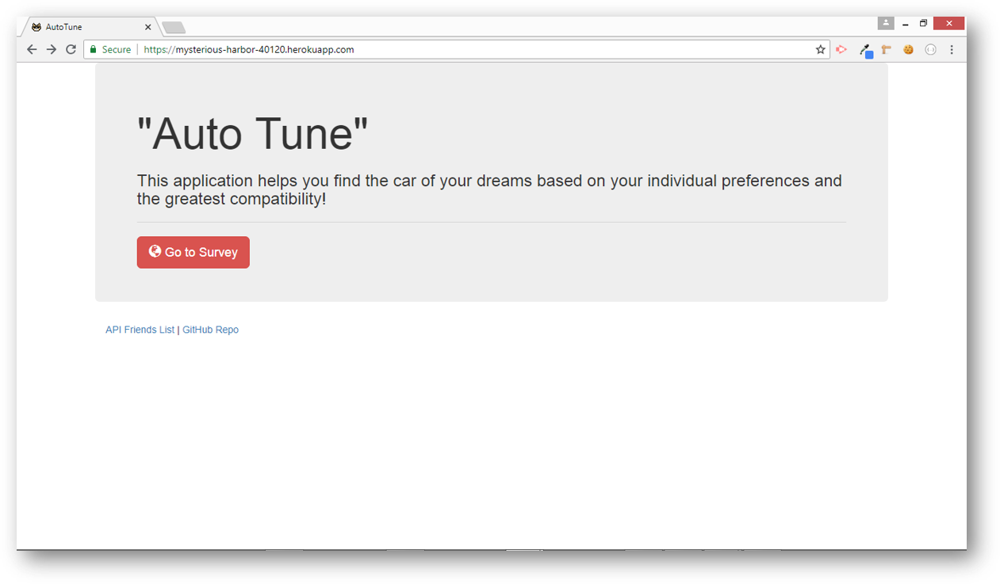
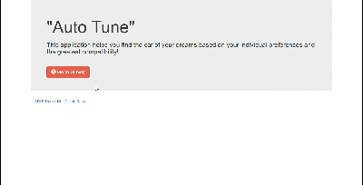

# Auto Tune - Node and Express Server Application
*UCF Coding Bootcamp Week 13 Homework*

## Synopsis

This purpose of this application is to perform a user compatibility-based "Automobile Finder" function. This site leverages the capabilities of a full-stack site hosted on Heroku. It asks the user a series of personal questions, takes the results from the users' survey, and then compares their answers with pre-established metrics assigned to various car types. The app will then display the name and picture of the car with the best overall match. This application utilizes Node. It also utilizes [express](https://www.npmjs.com/package/express), [body-parser](https://www.npmjs.com/package/body-parser), path, and Http npm modules.

## Example

Upon executing the application, the user will be taken to the homepage.

The survey asks the user a series of personal questions, takes the results from the users' survey, and then compares their answers with pre-established metrics assigned to various car types. The app will then display the name and picture of the car with the best overall match.

## Relation to Friend Finder Application (...portions under construction)

This application was developed to meet requirements for the UCF Coding Bootcamp. As a result of the following the assignment instructions, there are a few references to FriendFinder in the application directory structure and the code. The UCF Coding Bootcamp requirement asked students to create a compatibility-based "FriendFinder" application; basically a dating app. I modified the application to match the user up with a best-fit car type (because cars are more reliable than people anyway). 